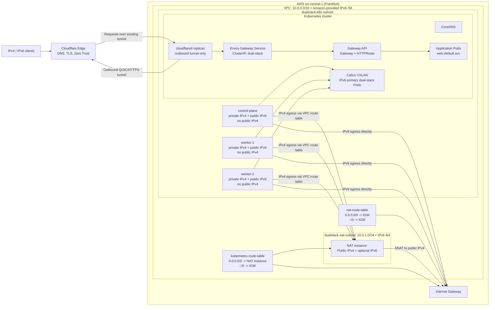

# Dual-Stack Kubernetes on AWS with kubeadm, Calico, Envoy Gateway, and Cloudflare Tunnel

Deploy a multi-node, Kubernetes cluster on AWS using `kubeadm` with dual-stack Pod and Service networking, public IPv6-only Kubernetes nodes, low-cost self-hosted IPv4 egress, and Zero Trust ingress through Cloudflare Tunnel.

This design avoids AWS Managed NAT Gateway charges, AWS Managed Load Balancer charges, and public IPv4 charges on Kubernetes nodes. It keeps inbound web traffic closed at AWS and exposes applications through Cloudflare's edge for both IPv4 and IPv6 clients.

**Project Status & Testing**
The complete setup process has been rigorously tested and is verified as functional. (Last tested: June 19, 2026). Documentation and troubleshooting workflows were refined with the assistance of AI tools.

**Note on Production Readiness**
This repository provides a step-by-step manual guide intended strictly for educational purposes and proof-of-concept deployments. Due to the high complexity of this dual-stack architecture, deploying this in a real production environment should be entirely automated using Infrastructure as Code (IaC) to prevent misconfigurations and human error.

---

## Support and Credits

If this repository helps you, consider giving it a star so others can find it.

Special thanks to [CloudWithVarJosh](https://github.com/CloudWithVarJosh/CKA-Certification-Course-2025/tree/main/Day%2054) for the foundational IPv4 setup that inspired this dual-stack adaptation.


---

## Table of Contents
---

- [Architecture Goals](#architecture-goals)
- [Architecture Diagram](#architecture-diagram)
- [Cost Savings Breakdown](#cost-savings-breakdown)
- [Prerequisites](#prerequisites)
  - [Network Plan](#network-plan)
  - [VPC & Network Foundation](#vpc--network-foundation)
  - [Security Groups](#security-groups)
  - [Subnets](#subnets)
  - [Create Route Tables](#create-route-tables)
  - [SSH Key Pair](#ssh-key-pair)
  - [EC2 Instance Plan](#ec2-instance-plan)
- [Configure the Self-Hosted NAT Instance](#configure-the-self-hosted-nat-instance)
- [Install Kubernetes](#install-kubernetes)
  - [Step 1: Prepare the OS](#step-1-prepare-the-os-all-kubernetes-nodes)
  - [Step 2: Install containerd](#step-2-install-containerd-all-kubernetes-nodes)
  - [Step 3: Install kubeadm, kubelet, and kubectl](#step-3-install-kubeadm-kubelet-and-kubectl-all-kubernetes-nodes)
  - [Step 4: Pin Dual-Stack Kubelet Node IPs](#step-4-pin-dual-stack-kubelet-node-ips-all-kubernetes-nodes)
  - [Step 5: Initialize the Control Plane](#step-5-initialize-the-control-plane-control-plane-only)
  - [Step 5.1: Join Worker Nodes](#step-51-join-worker-nodes-worker-nodes-only)
  - [Step 6: Install Calico with the Tigera Operator](#step-6-install-calico-with-the-tigera-operator-control-plane-only)
  - [Step 8: Label Worker Nodes](#step-8-label-worker-nodes-control-plane-only)
- [Install Gateway API, Envoy Gateway, and Cloudflare Tunnel](#install-gateway-api-envoy-gateway-and-cloudflare-tunnel)
  - [Step 9: Deploy a Test Application](#step-9-deploy-a-test-application-control-plane-only)
  - [Step 10: Install Envoy Gateway](#step-10-install-envoy-gateway-control-plane-only)
  - [Step 11: Configure Envoy as an Internal ClusterIP Gateway](#step-11-configure-envoy-as-an-internal-clusterip-gateway-control-plane-only)
  - [Step 12: Create the Gateway and HTTPRoute](#step-12-create-the-gateway-and-httproute-control-plane-only)
  - [Step 13: Deploy Cloudflare Tunnel](#step-13-deploy-cloudflare-tunnel-control-plane-only)
- [Verification Checklist](#verification-checklist)
  - [Verify AWS Network Egress](#verify-aws-network-egress)
  - [Verify Kubernetes Nodes](#verify-kubernetes-nodes)
  - [Verify Calico](#verify-calico)
  - [Verify CoreDNS](#verify-coredns)
  - [Verify Envoy Gateway](#verify-envoy-gateway)
  - [Verify Cloudflare Tunnel](#verify-cloudflare-tunnel)
  - [Verify End-to-End Ingress](#verify-end-to-end-ingress)
- [Troubleshooting](#troubleshooting)
- [Architectural Trade-offs](#architectural-trade-offs)
- [Cleanup](#cleanup)
- [References](#references)


---

## Architecture Goals

This guide builds a functional self-managed Kubernetes cluster with:

- **Dual-stack Kubernetes networking:** IPv6-primary Pod and Service CIDRs with secondary IPv4 support.
- **No public IPv4 on Kubernetes nodes:** nodes use private IPv4 inside the VPC and public IPv6 for direct IPv6 reachability.
- **Low-cost outbound IPv4:** a small NAT instance performs IPv4 SNAT with `iptables` masquerading.
- **No AWS NLB or ALB:** ingress uses Gateway API, Envoy Gateway, and Cloudflare Tunnel.
- **Outbound-only ingress path:** `cloudflared` opens encrypted outbound tunnels to Cloudflare, so AWS security groups do not need inbound HTTP or HTTPS.
- **IPv4 client compatibility:** public IPv4 users connect to Cloudflare's edge, while the AWS cluster can remain IPv6-forward and private for inbound web traffic.

---

## Architecture Diagram



---

## Cost Savings Breakdown

The comparison below uses **AWS eu-central-1 (Frankfurt)** pricing and a 730-hour month.

### Assumptions

| Item                     | Assumption                                                                                                                                      |
| ------------------------ | ----------------------------------------------------------------------------------------------------------------------------------------------- |
| Region                   | `eu-central-1` / Frankfurt                                                                                                                      |
| Month length             | 730 hours                                                                                                                                       |
| Data processed           | 1 TB/month = 1,024 GB                                                                                                                           |
| Kubernetes node count    | 3 nodes: 1 control plane + 2 workers                                                                                                            |
| Traditional AWS setup    | 1 AWS Managed NAT Gateway, 1 Network Load Balancer, 3 node public IPv4 addresses                                                                |
| Proposed setup           | 1 NAT instance, no AWS Managed NAT Gateway, no AWS NLB/ALB, no public IPv4 on Kubernetes nodes                                                  |
| Excluded from both sides | EC2 compute for Kubernetes nodes, EBS volumes, snapshots, standard EC2 data transfer out to the internet, DNS, Cloudflare plan fees             |
| Conservative exclusion   | Public IPv4 charges for the NAT Gateway and NLB front-end IPs are not added to the traditional setup, although AWS can charge for those too     |

### Frankfurt Pricing Inputs

| Component                           | eu-central-1 price used |
| ----------------------------------- | ----------------------: |
| Managed NAT Gateway hourly          |           `$0.052/hour` |
| Managed NAT Gateway data processing |             `$0.052/GB` |
| Network Load Balancer hourly        |           `$0.027/hour` |
| Network Load Balancer LCU           |      `$0.006/LCU-hour`  |
| Public IPv4 address                 |        `$0.005/IP-hour` |
| `t4g.nano` Linux On-Demand          |          `$0.0048/hour` |

### Traditional AWS Setup

| Cost item                                  |         Calculation |  Monthly cost |
| ------------------------------------------ | ------------------: | ------------: |
| Managed NAT Gateway hourly                 |      `730 * $0.052` |      `$37.96` |
| Managed NAT Gateway data processing        |    `1,024 * $0.052` |      `$53.25` |
| Network Load Balancer hourly               |      `730 * $0.027` |      `$19.71` |
| Network Load Balancer processed bytes LCU  | `1,024 GB * $0.006` |       `$6.14` |
| Public IPv4 on 3 Kubernetes nodes          |  `3 * 730 * $0.005` |      `$10.95` |
| **Traditional monthly subtotal**           |                     | **`$128.01`** |

For the NLB calculation, 1 TB/month averaged over 730 hours is about `1.40 GB/hour`, so the processed-bytes dimension is about `1.40 LCUs/hour`. Real NLB costs can be higher if new connections or active connections dominate.

### Proposed Architecture

| Cost item                       |        Calculation | Monthly cost |
| ------------------------------- | -----------------: | -----------: |
| `t4g.nano` NAT instance         |    `730 * $0.0048` |      `$3.50` |
| Public IPv4 for NAT instance    | `1 * 730 * $0.005` |      `$3.65` |
| Managed NAT Gateway             |           Not used |      `$0.00` |
| AWS NLB/ALB                     |           Not used |      `$0.00` |
| Public IPv4 on Kubernetes nodes |           Not used |      `$0.00` |
| **Proposed monthly subtotal**   |                    |  **`$7.15`** |

### Estimated Monthly Savings

| Comparison                    |        Amount |
| ----------------------------- | ------------: |
| Traditional monthly subtotal  |     `$128.01` |
| Proposed monthly subtotal     |       `$7.15` |
| **Estimated monthly savings** | **`$120.86`** |
| **Estimated reduction**       |  **`~94.4%`** |

If the NAT instance public IPv4 is replaced with BYOIP or the design removes IPv4 egress entirely, the proposed subtotal drops to the NAT instance compute cost only. If you include public IPv4 charges for the traditional NAT Gateway EIP and NLB front-end IPs, the traditional subtotal increases further.

---

## Prerequisites

### Network Plan

| Resource           | Value                                           |
| ------------------ | ----------------------------------------------- |
| AWS Region         | `eu-central-1`                                  |
| VPC IPv4 CIDR      | `10.0.0.0/16`                                   |
| VPC IPv6 CIDR      | Amazon-provided `/56`                           |
| Kubernetes subnet  | `10.0.0.0/24` + one IPv6 `/64`                  |
| NAT subnet         | `10.0.1.0/24` + optional IPv6 `/64`             |
| Pod CIDRs          | `fd00:192:168::/48,192.168.0.0/16`              |
| Service CIDRs      | `fd00:10:96::/108,10.96.0.0/12`                 |
| Kubernetes version | `v1.35`                                         |
| CNI                | Calico via Tigera Operator                      |
| Ingress            | Gateway API + Envoy Gateway + Cloudflare Tunnel |

### VPC & Network Foundation
Create a dual-stack VPC to establish the network boundary for private IPv4 routing and public IPv6 egress.

* **VPC Name:** `dualstack-vpc-1`
* **IPv4 CIDR:** `10.0.0.0/16` *(Provides private address space for internal cluster communication)*
* **IPv6 CIDR:** Amazon-provided `/56` *(Assigns globally routable IPs to avoid IPv6 NAT costs)*
* **DNS Resolution & Hostnames:** `Enabled` *(Required for external domain resolution and internal hostname-to-IP mapping)*
* **Internet Gateway:** Create `internet-gateway-1` and attach the VPC (Provides the physical outbound path for the nodes and the NAT instance)

### Security Groups

Use three security groups:

- `control-plane-sg`
- `data-plane-sg`
- `nat-sg`

Keep outbound traffic open unless your environment requires explicit egress controls. If you restrict egress, allow package repositories, container registries, Cloudflare Tunnel endpoints, Kubernetes control-plane traffic, DNS, and NTP.

**IMPORTANT: Attach ALL security groups to `dualstack-vpc-1`**

#### `control-plane-sg` inbound

| Purpose                           | Protocol / Port | Source                              | Required                                |
| --------------------------------- | --------------- | ----------------------------------- | --------------------------------------- |
| SSH                               | TCP 22          | Your admin IPv6 `/128`              | Yes                                     |
| Kubernetes API                    | TCP 6443        | `data-plane-sg`                     | Yes                                     |
| Kubernetes API admin access       | TCP 6443        | Your admin IPv6 `/128`              | Recommended                             |
| Kubelet API on control-plane node | TCP 10250       | `control-plane-sg`                  | Yes                                     |
| Calico VXLAN                      | UDP 4789        | `control-plane-sg`, `data-plane-sg` | Yes                                     |
| Calico Typha                      | TCP 5473        | `control-plane-sg`, `data-plane-sg` | If Typha can run on control-plane nodes |
| etcd peer/client                  | TCP 2379-2380   | `control-plane-sg`                  | Multi-control-plane only                |
| kube-scheduler                    | TCP 10259       | `control-plane-sg`                  | Multi-control-plane only                |
| kube-controller-manager           | TCP 10257       | `control-plane-sg`                  | Multi-control-plane only                |

#### `control-plane-sg` outbound

| Purpose                         | Protocol / Port | Destination  | Required |
| ------------------------------- | --------------- | ------------ | -------- | 
| IPv4 Internet access (via NAT)  | All traffic     | `0.0.0.0/0`  | Yes      |
| IPv6 Internet access (via IGW)  | All traffic     | `::/0`       | Yes      |

---

#### `data-plane-sg` inbound

| Purpose      | Protocol / Port | Source                              | Required                    |
| ------------ | --------------- | ----------------------------------- | --------------------------- |
| SSH          | TCP 22          | Your admin IPv6 `/128`              | Yes                         |
| Kubelet API  | TCP 10250       | `control-plane-sg`                  | Yes                         |
| Calico VXLAN | UDP 4789        | `control-plane-sg`, `data-plane-sg` | Yes                         |
| Calico Typha | TCP 5473        | `control-plane-sg`, `data-plane-sg` | If Typha can run on workers |

Do **not** open NodePort ranges for this architecture. Cloudflare Tunnel reaches Envoy through the Kubernetes network, not through inbound AWS NodePorts.

#### `data-plane-sg` outbound
| Purpose                          | Protocol / Port  | Destination  | Required |
| -------------------------------- | ---------------- | ------------ | -------- | 
| IPv4 Internet access (via NAT)   | All traffic      | `0.0.0.0/0`  | Yes      |
| IPv6 Internet access (via IGW)   | All traffic      | `::/0`       | Yes      |

---

#### `nat-sg` inbound

| Purpose                          | Protocol / Port  | Source                                                | Required |
| -------------------------------- | ---------------- | ----------------------------------------------------- | -------- |
| SSH                              | TCP 22           | Your admin IPv6 `/128` or your admin IPv4 `/32`       | Yes      |
| Forwarded IPv4 egress from nodes | All traffic      | `control-plane-sg`, `data-plane-sg`, or `10.0.0.0/24` | Yes      |

#### `nat-sg` outbound

| Purpose                           | Protocol / Port | Destination  | Required   |
| --------------------------------- | ---------------- | ------------| ---------- |
| Forwarded IPv4 access to Internet | All IPv4 traffic | `0.0.0.0/0` | Yes        |

---

### Subnets

#### Kubernetes subnet

Create `dualstack-k8s-subnet`:

| Setting                 | Value                                           |
| ----------------------- | ----------------------------------------------- |
| IPv4 CIDR               | `10.0.0.0/24`                                   |
| IPv6 CIDR               | Create one subnet `/64` from the VPC IPv6 `/56` |
| Route table             | Private Kubernetes route table                  |
| Auto-assign IPv6        | Enabled                                         |
| Auto-assign public IPv4 | Disabled                                        |

#### NAT subnet

Create `dualstack-nat-subnet`:

| Setting                 | Value                                                 |
| ----------------------- | ----------------------------------------------------- |
| IPv4 CIDR               | `10.0.1.0/24`                                         |
| IPv6 CIDR               | Create a subnet `/64` from the VPC IPv6 `/56`         |
| Route table             | nat-route-table                                       |
| Auto-assign public IPv4 | Enabled                                               |
| Auto-assign IPv6        | Optional (useful for IPv6 SSH management)             |

Important: The IPv6 `/64` block for the NAT subnet must not overlap with the Kubernetes subnet. For example, if your VPC provided `2001:db8:1234:5600::/56`, you could use `2001:db8:1234:5600::/64` for the Kubernetes subnet and `2001:db8:1234:5601::/64` for the NAT subnet.

---

### Create Route Tables

#### NAT route table

**Name:** `nat-route-table`
**Association:** `dualstack-nat-subnet`.

| Destination   | Target                                |
| ------------- | ------------------------------------- |
| `10.0.0.0/16` | local                                 |
| VPC IPv6 CIDR | local                                 |
| `0.0.0.0/0`   | Internet Gateway `internet-gateway-1` |
| `::/0`        | Internet Gateway `internet-gateway-1` |

#### Kubernetes route table 

**Name:** `kubernetes-route-table`
**Association:** `dualstack-k8s-subnet`.

| Destination   | Target                                                  |
| ------------- | ------------------------------------------------------- |
| `10.0.0.0/16` | local                                                   |
| VPC IPv6 CIDR | local                                                   |
| `::/0`        | Internet Gateway `internet-gateway-1`                   |
| `0.0.0.0/0`   | NAT instance ENI, **after** the NAT instance is created |

The IPv6 default route points directly to the Internet Gateway because AWS IPv6 addresses are globally routable and security groups control exposure. The IPv4 default route points to the NAT instance because Kubernetes nodes do not have public IPv4 addresses.

---

### SSH Key Pair

Create an ED25519 key pair in the AWS EC2 console and download the private key.

```bash
chmod 400 ~/.ssh/kubeadm-dualstack.pem

ssh -i ~/.ssh/kubeadm-dualstack.pem ubuntu@<NODE_PUBLIC_IPV6>
```

For IPv6 SSH, ensure your local network has IPv6 connectivity and your security group allows your current IPv6 `/128`.

---

### EC2 Instance Plan

Use Ubuntu 24.04 LTS.

| Role          | Name          |  Instance type        | Subnet                 | Security Group | Public IPv4 | Public IPv6 | Notes                                               |
| ------------- | ------------- | --------------------- | ---------------------- | ---------------------- | ----------- | ----------- | --------------------------------------------------- |
| NAT instance  | nat-1         | 2 vCPU, 1-4GB RAM    | `dualstack-nat-subnet` | ---------------------- | Yes         | Optional    | ARM64 Ubuntu AMI, source/destination check disabled |
| Control plane | control-plane | 2 vCPU, 4-8 GB RAM   | `dualstack-k8s-subnet` | ---------------------- | No          | Yes         | `kubeadm` expects at least 2 vCPU and 2 GB                  |
| Worker 1      | worker-1      | 1-2 vCPU, 2-4 GB RAM | `dualstack-k8s-subnet` | ---------------------- | No          | Yes         | Demo worker                                         |
| Worker 2      | worker-2      | 1-2 vCPU, 2-4 GB RAM | `dualstack-k8s-subnet` | ---------------------- | No          | Yes         | Demo worker                                         |

Recommended hostnames:

```bash
sudo hostnamectl set-hostname control-plane
sudo hostnamectl set-hostname worker-1
sudo hostnamectl set-hostname worker-2
sudo hostnamectl set-hostname nat-1
exec bash
```

---

## Configure the Self-Hosted NAT Instance

Run this section on the `nat-1` instance.

### 1. Disable Source/Destination Check

In the AWS EC2 console:

1. Select the NAT instance.
2. Go to **Actions > Networking > Change source/destination check**.
3. Disable the check.

Without this setting, AWS drops traffic that the instance is forwarding for other nodes.

### 2. Enable IPv4 Forwarding and Masquerading

```bash
set -euo pipefail

IFACE="$(ip -o -4 route show to default | awk '{print $5; exit}')"
echo "Using outbound interface: ${IFACE}"

cat <<'EOF' | sudo tee /etc/sysctl.d/99-nat-instance.conf
net.ipv4.ip_forward=1
EOF

sudo sysctl --system

sudo apt-get update
sudo DEBIAN_FRONTEND=noninteractive apt-get install -y iptables-persistent netfilter-persistent

sudo iptables -t nat -C POSTROUTING -o "${IFACE}" -j MASQUERADE 2>/dev/null \
  || sudo iptables -t nat -A POSTROUTING -o "${IFACE}" -j MASQUERADE

sudo netfilter-persistent save

sudo sysctl net.ipv4.ip_forward
sudo iptables -t nat -S POSTROUTING
```

Expected output includes:

```text
net.ipv4.ip_forward = 1
-A POSTROUTING -o <interface> -j MASQUERADE
```

### 3. Add the Private IPv4 Default Route

In the AWS VPC console:

1. Open the `kubernetes-route-table` associated with `dualstack-k8s-subnet`.
2. Add route:
   - Destination: `0.0.0.0/0`
   - Target: Internet gateway and select the NAT instance `nat-1`
3. Save changes.

### 4. Verify IPv4 and IPv6 Egress from a Kubernetes Node

Run this from the control-plane or a worker node after it is launched.

```bash
ping -6 -c 4 2606:4700:4700::1111
ping -4 -c 4 1.1.1.1
```

Expected result:

- `ping` returns valid ping statistics: `4 packets transmitted, 4 received, 0% packet loss, time 2003ms`

---

## Install Kubernetes

Run commands exactly where the headings say:

- **[ALL KUBERNETES NODES]** means control plane and workers.
- **[CONTROL PLANE ONLY]** means the control-plane node.
- **[WORKER NODES ONLY]** means each worker node.
- **[ANY NODE WITH KUBECONFIG]** means a machine with working `kubectl` access.

### Step 1: Prepare the OS [ALL KUBERNETES NODES]

```bash
set -euo pipefail

sudo swapoff -a
sudo sed -i.bak '/ swap / s/^\(.*\)$/#\1/g' /etc/fstab

cat <<'EOF' | sudo tee /etc/modules-load.d/k8s.conf
overlay
br_netfilter
EOF

sudo modprobe overlay
sudo modprobe br_netfilter

cat <<'EOF' | sudo tee /etc/sysctl.d/99-kubernetes-cri.conf
net.bridge.bridge-nf-call-iptables=1
net.bridge.bridge-nf-call-ip6tables=1
net.ipv4.ip_forward=1
net.ipv6.conf.all.forwarding=1
EOF

sudo sysctl --system
```

### Step 2: Install containerd [ALL KUBERNETES NODES]

```bash
set -euo pipefail

sudo apt-get update
sudo DEBIAN_FRONTEND=noninteractive apt-get install -y ca-certificates curl gpg containerd

sudo mkdir -p /etc/containerd
containerd config default | sudo tee /etc/containerd/config.toml >/dev/null

sudo sed -i 's/SystemdCgroup = false/SystemdCgroup = true/' /etc/containerd/config.toml
sudo sed -i 's#sandbox_image = ".*"#sandbox_image = "registry.k8s.io/pause:3.10.1"#' /etc/containerd/config.toml

sudo systemctl daemon-reload
sudo systemctl enable --now containerd
sudo systemctl status containerd --no-pager
```

### Step 3: Install kubeadm, kubelet, and kubectl [ALL KUBERNETES NODES]

```bash
set -euo pipefail

K8S_MINOR="v1.35"

sudo mkdir -p /etc/apt/keyrings

curl -fsSL "https://pkgs.k8s.io/core:/stable:/${K8S_MINOR}/deb/Release.key" \
  | sudo gpg --dearmor -o /etc/apt/keyrings/kubernetes-apt-keyring.gpg

echo "deb [signed-by=/etc/apt/keyrings/kubernetes-apt-keyring.gpg] https://pkgs.k8s.io/core:/stable:/${K8S_MINOR}/deb/ /" \
  | sudo tee /etc/apt/sources.list.d/kubernetes.list

sudo apt-get update
sudo DEBIAN_FRONTEND=noninteractive apt-get install -y kubelet kubeadm kubectl
sudo apt-mark hold kubelet kubeadm kubectl

sudo systemctl enable kubelet

kubeadm version
kubelet --version
kubectl version --client=true
```

Optional shell quality-of-life setup:

```bash
sudo apt-get update
sudo DEBIAN_FRONTEND=noninteractive apt-get install -y bash-completion

grep -q 'kubectl completion bash' ~/.bashrc || cat <<'EOF' >> ~/.bashrc
source /usr/share/bash-completion/bash_completion
source <(kubectl completion bash)
alias k=kubectl
complete -F __start_kubectl k
EOF

source ~/.bashrc
```

### Step 4: Pin Dual-Stack Kubelet Node IPs [ALL KUBERNETES NODES]

Run this before `kubeadm init` on the control plane and before `kubeadm join` on each worker.

Use the node's AWS public IPv6 and private IPv4. IPv6 is listed first because this cluster is IPv6-primary.

```bash
hostname -I
ip -br addr
```

Set the values explicitly:

```bash
NODE_IPV6="<NODE_PUBLIC_IPV6>"
NODE_IPV4="<NODE_PRIVATE_IPV4>"

echo "KUBELET_EXTRA_ARGS=\"--node-ip=${NODE_IPV6},${NODE_IPV4}\"" | sudo tee /etc/default/kubelet

sudo systemctl daemon-reload
sudo systemctl restart kubelet || echo "kubelet will become healthy after kubeadm initializes or joins this node"
```

### Step 5: Initialize the Control Plane [CONTROL PLANE ONLY]

Use the control-plane node's public IPv6 address.

When appending a port to an IPv6 address, wrap the address in brackets. Do not use brackets for `--apiserver-advertise-address`.

```bash
CP_IPV6="<CONTROL_PLANE_PUBLIC_IPV6>"

sudo kubeadm init \
  --control-plane-endpoint="[${CP_IPV6}]:6443" \
  --apiserver-advertise-address="${CP_IPV6}" \
  --pod-network-cidr="fd00:192:168::/48,192.168.0.0/16" \
  --service-cidr="fd00:10:96::/108,10.96.0.0/12"
```
Configure `kubectl` for the `ubuntu` user:

```bash
mkdir -p "${HOME}/.kube"
sudo cp /etc/kubernetes/admin.conf "${HOME}/.kube/config"
sudo chown "$(id -u):$(id -g)" "${HOME}/.kube/config"

kubectl get nodes -o wide
```

### Step 5.1: Join Worker Nodes [WORKER NODES ONLY]

On the control plane, generate a fresh join command:

```bash
kubeadm token create --print-join-command
```

Run the generated command on each worker node.

It will look similar to:

```bash
sudo kubeadm join [<CONTROL_PLANE_PUBLIC_IPV6>]:6443 --token <TOKEN> \
  --discovery-token-ca-cert-hash sha256:<HASH>
```

After each worker joins, check from the control plane:

```bash
kubectl get nodes -o wide
```

### Step 6: Install Calico with the Tigera Operator [CONTROL PLANE ONLY]

```bash
kubectl create -f https://raw.githubusercontent.com/projectcalico/calico/v3.32.0/manifests/v1_crd_projectcalico_org.yaml
kubectl create -f https://raw.githubusercontent.com/projectcalico/calico/v3.32.0/manifests/tigera-operator.yaml

kubectl wait --timeout=3m -n tigera-operator deployment/tigera-operator --for=condition=Available
```

Apply the dual-stack Calico installation:

```bash
cat <<'EOF' | kubectl apply -f -
apiVersion: operator.tigera.io/v1
kind: Installation
metadata:
  name: default
spec:
  calicoNetwork:
    bgp: Disabled
    ipPools:
    - cidr: fd00:192:168::/48
      natOutgoing: Enabled
      blockSize: 122
      encapsulation: VXLANCrossSubnet
      nodeSelector: all()
    - cidr: 192.168.0.0/16
      natOutgoing: Enabled
      blockSize: 26
      encapsulation: VXLANCrossSubnet
      nodeSelector: all()
EOF
```

Wait for Calico and nodes:

```bash
kubectl -n calico-system rollout status ds/calico-node --timeout=10m
kubectl -n calico-system rollout status deploy/calico-typha --timeout=10m
kubectl wait --timeout=10m --for=condition=Ready nodes --all

kubectl get nodes -o wide
kubectl -n calico-system get pods -o wide
```

### Step 8: Label Worker Nodes [CONTROL PLANE ONLY]

```bash
kubectl label node worker-1 node-role.kubernetes.io/worker=
kubectl label node worker-2 node-role.kubernetes.io/worker=

kubectl get nodes
```

---

## Install Gateway API, Envoy Gateway, and Cloudflare Tunnel

This ingress model does not create an AWS NLB or ALB. Cloudflare reaches the cluster through outbound `cloudflared` tunnels, and `cloudflared` forwards requests to Envoy Gateway inside the cluster.

Traffic flow:

```text
Client -> Cloudflare Edge -> cloudflared Pod -> Envoy Gateway ClusterIP Service -> HTTPRoute -> Kubernetes Service -> Pod
```

### Step 9: Deploy a Test Application [CONTROL PLANE ONLY]

```bash
cat <<'EOF' | kubectl apply -f -
apiVersion: apps/v1
kind: Deployment
metadata:
  name: web
  namespace: default
spec:
  replicas: 3
  selector:
    matchLabels:
      app: web
  template:
    metadata:
      labels:
        app: web
    spec:
      containers:
      - name: nginx
        image: nginx:1.27-alpine
        ports:
        - containerPort: 80
---
apiVersion: v1
kind: Service
metadata:
  name: web
  namespace: default
spec:
  type: ClusterIP
  ipFamilyPolicy: RequireDualStack
  ipFamilies:
  - IPv6
  - IPv4
  selector:
    app: web
  ports:
  - name: http
    port: 80
    targetPort: 80
EOF

kubectl rollout status deployment/web --timeout=3m
kubectl get svc web -o wide
```

Verify the application inside the cluster:

```bash
kubectl run web-check \
  --rm -i \
  --restart=Never \
  --image=curlimages/curl:8.11.1 \
  -- curl -sv http://web.default.svc.cluster.local/
```

### Step 10: Install Envoy Gateway [CONTROL PLANE ONLY]

```bash
kubectl apply --server-side -f https://github.com/envoyproxy/gateway/releases/download/v1.7.2/install.yaml

kubectl wait --timeout=5m -n envoy-gateway-system deployment/envoy-gateway --for=condition=Available
kubectl -n envoy-gateway-system get pods -o wide
```

### Step 11: Configure Envoy as an Internal ClusterIP Gateway [CONTROL PLANE ONLY]

This keeps Envoy internal to Kubernetes. Cloudflare Tunnel will connect to Envoy by Kubernetes DNS name.

```bash
kubectl create namespace gateways --dry-run=client -o yaml | kubectl apply -f -

cat <<'EOF' | kubectl apply -f -
apiVersion: gateway.envoyproxy.io/v1alpha1
kind: EnvoyProxy
metadata:
  name: internal-clusterip
  namespace: envoy-gateway-system
spec:
  provider:
    type: Kubernetes
    kubernetes:
      envoyService:
        type: ClusterIP
  ipFamily: DualStack
---
apiVersion: gateway.networking.k8s.io/v1
kind: GatewayClass
metadata:
  name: envoy-internal
spec:
  controllerName: gateway.envoyproxy.io/gatewayclass-controller
  parametersRef:
    group: gateway.envoyproxy.io
    kind: EnvoyProxy
    name: internal-clusterip
    namespace: envoy-gateway-system
EOF

kubectl get gatewayclass envoy-internal -o wide
```

### Step 12: Create the Gateway and HTTPRoute [CONTROL PLANE ONLY]

Replace `your-app.example.com` with the hostname you will configure in Cloudflare.

```bash
APP_HOST="your-app.example.com"

cat <<EOF | kubectl apply -f -
apiVersion: gateway.networking.k8s.io/v1
kind: Gateway
metadata:
  name: frontend-gateway
  namespace: gateways
spec:
  gatewayClassName: envoy-internal
  listeners:
  - name: http
    protocol: HTTP
    port: 80
    hostname: "${APP_HOST}"
    allowedRoutes:
      namespaces:
        from: All
---
apiVersion: gateway.networking.k8s.io/v1
kind: HTTPRoute
metadata:
  name: web-route
  namespace: default
spec:
  parentRefs:
  - name: frontend-gateway
    namespace: gateways
  hostnames:
  - "${APP_HOST}"
  rules:
  - matches:
    - path:
        type: PathPrefix
        value: /
    backendRefs:
    - name: web
      port: 80
EOF
```

Wait for Envoy to create the data-plane service:

```bash
kubectl -n gateways get gateway frontend-gateway -o wide
kubectl -n default get httproute web-route -o wide
kubectl -n envoy-gateway-system get pods,svc -o wide
```

Find the generated Envoy service name. It usually starts with `envoy-gateways-frontend-gateway`.

```bash
kubectl -n envoy-gateway-system get svc
```

Test Envoy internally:

```bash
APP_HOST="your-app.example.com"

ENVOY_SVC="$(kubectl -n envoy-gateway-system get svc -o jsonpath='{range .items[*]}{.metadata.name}{"\n"}{end}' \
  | grep '^envoy-gateways-frontend-gateway' \
  | head -n1)"

echo "Envoy service: ${ENVOY_SVC}"

kubectl run envoy-check \
  --rm -i \
  --restart=Never \
  --image=curlimages/curl:8.11.1 \
  -- curl -sv -H "Host: ${APP_HOST}" "http://${ENVOY_SVC}.envoy-gateway-system.svc.cluster.local/"
```

### Step 13: Deploy Cloudflare Tunnel [CONTROL PLANE ONLY]

Create a tunnel in the Cloudflare Zero Trust dashboard:

1. Go to **Zero Trust > Networks > Connectors**.
2. Create a **Cloudflared** tunnel.
3. Copy the token from the generated `cloudflared tunnel run --token ...` command.
4. In **Public Hostname**, map your hostname, for example `your-app.example.com`, to the internal Envoy service URL:

```text
http://<ENVOY_SERVICE>.envoy-gateway-system.svc.cluster.local:80
```
The Envoy Service starts with: envoy-gateways-frontend-gateway.
Check your Envoy Service: ```bash kubectl get svc -n envoy-gateway-system```

Create the Kubernetes secret and deployment:

```bash
kubectl create namespace cloudflare --dry-run=client -o yaml | kubectl apply -f -

kubectl -n cloudflare create secret generic cloudflared-token \
  --from-literal=token='<YOUR_CLOUDFLARED_TUNNEL_TOKEN>' \
  --dry-run=client -o yaml | kubectl apply -f -
```

Deploy `cloudflared`:

```bash
cat <<'EOF' | kubectl apply -f -
apiVersion: apps/v1
kind: Deployment
metadata:
  name: cloudflared
  namespace: cloudflare
spec:
  replicas: 2
  selector:
    matchLabels:
      app: cloudflared
  template:
    metadata:
      labels:
        app: cloudflared
    spec:
      containers:
      - name: cloudflared
        image: cloudflare/cloudflared:latest
        imagePullPolicy: Always
        args:
        - tunnel
        - --no-autoupdate
        - --metrics
        - 0.0.0.0:2000
        - run
        env:
        - name: TUNNEL_TOKEN
          valueFrom:
            secretKeyRef:
              name: cloudflared-token
              key: token
        ports:
        - name: metrics
          containerPort: 2000
        readinessProbe:
          httpGet:
            path: /ready
            port: metrics
          initialDelaySeconds: 10
          periodSeconds: 10
        livenessProbe:
          httpGet:
            path: /ready
            port: metrics
          initialDelaySeconds: 30
          periodSeconds: 20
        resources:
          requests:
            cpu: 50m
            memory: 64Mi
          limits:
            memory: 128Mi
EOF

kubectl -n cloudflare rollout status deployment/cloudflared --timeout=5m
kubectl -n cloudflare get pods -o wide
```

For repeatable production deployments, pin `cloudflare/cloudflared` to a release tag or image digest instead of `latest`.

---

## Verification Checklist

### Verify AWS Network Egress

Run on each Kubernetes node.

```bash
ping -4 1.1.1.1
ping -6 2606:4700:4700::1111
```

Expected return:

```bash
--- 2606:4700:4700::1111 ping statistics ---
4 packets transmitted, 4 received, 0% packet loss, time 3004ms

--- 1.1.1.1 ping statistics ---
4 packets transmitted, 4 received, 0% packet loss, time 2003ms
```


Verify the Kubernetes nodes do not have public IPv4 from EC2 metadata:

```bash
TOKEN="$(curl -sS -X PUT \
  -H 'X-aws-ec2-metadata-token-ttl-seconds: 60' \
  http://169.254.169.254/latest/api/token)"

curl -sS \
  -H "X-aws-ec2-metadata-token: ${TOKEN}" \
  http://169.254.169.254/latest/meta-data/public-ipv4 || true
```

Expected on Kubernetes nodes: no public IPv4 metadata value. The NAT instance is the exception.

Run on the NAT instance:

```bash
sudo sysctl net.ipv4.ip_forward
sudo iptables -t nat -vnL POSTROUTING
```

Expected:

- `net.ipv4.ip_forward = 1`
- MASQUERADE rule counters increase after Kubernetes nodes perform IPv4 egress.

### Verify Kubernetes Nodes

Run from the control plane.

```bash
kubectl get nodes -o wide
kubectl get pods -A -o wide
kubectl wait --timeout=5m --for=condition=Ready nodes --all
```

Expected:

- All nodes are `Ready`.
- Node IPs show both IPv6 and IPv4.
- System Pods are running or completed.

### Verify Calico

```bash
kubectl -n calico-system get pods -o wide
kubectl -n calico-system rollout status ds/calico-node --timeout=5m
kubectl -n calico-system rollout status deploy/calico-typha --timeout=5m

kubectl get ippools.crd.projectcalico.org -o wide

kubectl get installation.operator.tigera.io default \
  -o jsonpath='{.spec.calicoNetwork.bgp}{"\n"}'
```

Expected:

- `calico-node` is ready on every node.
- `calico-typha` is available.
- IP pools include `fd00:192:168::/48` and `192.168.0.0/16`.
- BGP output is `Disabled`.

Check for Calico errors:

```bash
kubectl -n calico-system logs ds/calico-node -c calico-node --tail=100 \
  | grep -Ei 'error|fail|bird|felix|typha' || true
```

No output is ideal. If output appears, inspect it before continuing.

### Verify CoreDNS

```bash
kubectl -n kube-system get deploy coredns
kubectl -n kube-system rollout status deploy/coredns --timeout=5m

kubectl run dns-check \
  --rm -i \
  --restart=Never \
  --image=busybox:1.36 \
  -- nslookup kubernetes.default.svc.cluster.local
```

Verify Pod egress over both families:

```bash
kubectl run egress-ipv4 \
  --rm -i \
  --restart=Never \
  --image=curlimages/curl:8.11.1 \
  -- curl -4sS https://checkip.amazonaws.com

kubectl run egress-ipv6 \
  --rm -i \
  --restart=Never \
  --image=curlimages/curl:8.11.1 \
  -- curl -6sS https://checkip.amazonaws.com
```

Expected:

- DNS resolution succeeds.
- IPv4 Pod egress returns the NAT instance public IPv4.
- IPv6 Pod egress returns a node IPv6.

### Verify Envoy Gateway

```bash
kubectl -n envoy-gateway-system rollout status deployment/envoy-gateway --timeout=5m
kubectl get gatewayclass envoy-internal -o wide
kubectl -n gateways get gateway frontend-gateway -o yaml
kubectl -n default get httproute web-route -o yaml
kubectl -n envoy-gateway-system get pods,svc -o wide
```

Check internal routing through Envoy:

```bash
APP_HOST="your-app.example.com"

ENVOY_SVC="$(kubectl -n envoy-gateway-system get svc -o jsonpath='{range .items[*]}{.metadata.name}{"\n"}{end}' \
  | grep '^envoy-gateways-frontend-gateway' \
  | head -n1)"

kubectl run envoy-route-check \
  --rm -i \
  --restart=Never \
  --image=curlimages/curl:8.11.1 \
  -- curl -sv -H "Host: ${APP_HOST}" "http://${ENVOY_SVC}.envoy-gateway-system.svc.cluster.local/"
```

Expected:

- Gateway has `Accepted=True` and `Programmed=True`.
- HTTPRoute has an accepted parent reference.
- Curl returns `HTTP/1.1 200 OK` or nginx HTML.

### Verify Cloudflare Tunnel

```bash
kubectl -n cloudflare rollout status deployment/cloudflared --timeout=5m
kubectl -n cloudflare get pods -o wide

kubectl -n cloudflare logs deployment/cloudflared --tail=100 \
  | grep -Ei 'registered tunnel connection|connected|error|fail'
```

Expected:

- Both `cloudflared` replicas are ready.
- Logs show registered tunnel connections.
- No repeated authentication, DNS, or connection failures.

Optional readiness endpoint check:

```bash
kubectl -n cloudflare port-forward deployment/cloudflared 2000:2000
```

In another terminal:

```bash
curl -sf http://127.0.0.1:2000/ready
```

Expected:

```text
OK
```

### Verify End-to-End Ingress

From your local machine:

```bash
curl -I https://your-app.example.com
curl -4 -I https://your-app.example.com
curl -6 -I https://your-app.example.com
```

Expected:

- IPv4 clients work through Cloudflare.
- IPv6 clients work through Cloudflare.
- No AWS inbound HTTP or HTTPS security group rule is required.

---

## Troubleshooting

### IPv4 egress fails from Kubernetes nodes

Check these in order:

1. The NAT instance has a public IPv4 address or Elastic IP.
2. Source/destination check is disabled on the NAT instance.
3. The private Kubernetes route table has `0.0.0.0/0` targeting the NAT instance ENI.
4. `nat-sg` allows inbound traffic from the Kubernetes node security groups or `10.0.0.0/24`.
5. The NAT instance has IPv4 forwarding enabled.
6. The NAT instance has an `iptables` MASQUERADE rule.
7. Network ACLs allow ephemeral return traffic.

Commands:

```bash
# NAT instance
sudo sysctl net.ipv4.ip_forward
sudo iptables -t nat -vnL POSTROUTING
curl -4sS https://checkip.amazonaws.com

# Kubernetes node
curl -4v https://checkip.amazonaws.com
```

### IPv6 SSH or Kubernetes API access fails

Check:

1. The subnet has auto-assign IPv6 enabled.
2. The instance has an IPv6 address attached.
3. The route table has `::/0` to the Internet Gateway.
4. The security group allows your current IPv6 `/128`.
5. Your local network actually supports IPv6.

Commands:

```bash
ip -6 addr
ip -6 route
curl -6sS https://checkip.amazonaws.com
```

### Calico Pods are `Running` but not ready

Common causes:

- VXLAN UDP 4789 is blocked between nodes.
- Typha TCP 5473 is blocked.
- Kubelet selected the wrong node IP family or wrong interface.
- BGP was not disabled.

Commands:

```bash
kubectl get installation.operator.tigera.io default \
  -o jsonpath='{.spec.calicoNetwork.bgp}{"\n"}'

kubectl -n calico-system get pods,svc,endpoints -o wide
kubectl -n calico-system logs ds/calico-node -c calico-node --tail=100
```

Force BGP disabled if required:

```bash
kubectl patch installation.operator.tigera.io default --type=merge \
  -p '{"spec":{"calicoNetwork":{"bgp":"Disabled"}}}'

kubectl -n calico-system rollout restart ds/calico-node
kubectl -n calico-system rollout status ds/calico-node --timeout=10m
```

### CoreDNS is not ready

CoreDNS usually fails because CNI is not ready or DNS egress is broken.

```bash
kubectl -n kube-system describe deploy coredns
kubectl -n kube-system logs deploy/coredns --tail=100
kubectl -n calico-system get pods -o wide
kubectl get nodes -o wide
```

After Calico is healthy, restart CoreDNS if needed:

```bash
kubectl -n kube-system rollout restart deploy/coredns
kubectl -n kube-system rollout status deploy/coredns --timeout=5m
```

### Gateway is not programmed

Check GatewayClass, Gateway, HTTPRoute, and Envoy controller logs:

```bash
kubectl get gatewayclass envoy-internal -o yaml
kubectl -n gateways describe gateway frontend-gateway
kubectl -n default describe httproute web-route
kubectl -n envoy-gateway-system logs deploy/envoy-gateway --tail=100
```

Common causes:

- `GatewayClass.spec.controllerName` is wrong.
- `HTTPRoute.spec.parentRefs` namespace or name is wrong.
- `HTTPRoute.spec.hostnames` does not match the request `Host` header.
- Backend Service name or port is wrong.

### Cloudflare Tunnel connects but the app returns 404

Check the hostname in three places:

1. Cloudflare Public Hostname.
2. Gateway listener hostname.
3. HTTPRoute hostname.

They must match the incoming request host.

```bash
APP_HOST="your-app.example.com"

kubectl run route-debug \
  --rm -i \
  --restart=Never \
  --image=curlimages/curl:8.11.1 \
  -- curl -sv -H "Host: ${APP_HOST}" "http://${ENVOY_SVC}.envoy-gateway-system.svc.cluster.local/"
```

### Cloudflare Tunnel Pods are not ready

Check token, egress, and logs:

```bash
kubectl -n cloudflare get secret cloudflared-token
kubectl -n cloudflare describe pod -l app=cloudflared
kubectl -n cloudflare logs deployment/cloudflared --tail=200
```

If you restrict egress, allow Cloudflare Tunnel outbound traffic. `cloudflared` commonly uses QUIC over UDP 7844 and can fall back to HTTPS over TCP 443.

### Clean-slate reset

Run on workers first, then the control plane.

```bash
sudo kubeadm reset -f
sudo rm -rf /etc/cni/net.d /var/lib/cni /var/lib/kubelet/pki ~/.kube
for link in cni0 vxlan.calico tunl0; do
  sudo ip link delete "${link}" 2>/dev/null || true
done
sudo systemctl restart containerd
```

On the control plane, also remove control-plane state:

```bash
sudo kubeadm reset -f
sudo rm -rf /etc/kubernetes /var/lib/etcd /etc/cni/net.d /var/lib/cni /var/lib/kubelet/pki ~/.kube
for link in cni0 vxlan.calico tunl0; do
  sudo ip link delete "${link}" 2>/dev/null || true
done
sudo systemctl restart containerd
```

---

## Architectural Trade-offs

| Area                    | Trade-off                                                                                                                         | Production hardening                                                                                                                                                      |
| ----------------------- | --------------------------------------------------------------------------------------------------------------------------------- | ------------------------------------------------------------------------------------------------------------------------------------------------------------------------- |
| Self-managed Kubernetes | `kubeadm` gives control, but you own upgrades, certificate rotation, etcd backups, and node lifecycle. This adds complexity.        | Automate backups, test restores, document upgrades, and use external monitoring.                                                                |
| NAT instance            | Much cheaper than Managed NAT Gateway, but it is self-managed and can become a single point of failure.                           | Use Managed NAT Gateway when HA is more important than cost.   |
| NAT throughput          | small EC2 instance is fine for low average throughput, but burst capacity and CPU credits can limit sustained traffic.                    | Size the NAT instance from measured throughput and packets per second. Consider bigger NAT instances, or a managed NAT Gateway for sustained load.                    |
| Ingress                 | Cloudflare Tunnel removes AWS NLB/ALB cost and inbound web exposure, but ingress depends on Cloudflare.                           | Monitor tunnel health, run multiple replicas                                                       |
| TLS boundary            | Cloudflare terminates public TLS. Traffic from `cloudflared` to Envoy is inside the cluster unless you configure upstream TLS.    | Use Full/Strict-style upstream TLS where required, issue internal certs, and configure Envoy HTTPS listeners.                                     |                        
| Cloudflare routing      | Cloudflare is a third-party edge and policy provider.                                                                             | Review compliance requirements, data processing terms.                                                             |

---

## Cleanup

Delete Cloudflare resources:
1. Delete Connector 
2. Delete CNAME entry for `your-app.example.com` in DNS 

Finally, delete AWS resources:

1. EC2 instances.
2. Subnets 
3. Route table entries targeting the NAT instance ENI.
5. Internet Gateway.
6. Security groups: There you must first delete all inbound rules before you can delete them.
7. VPC.
8. Elastic IP, if allocated.

---

## References

- [Kubernetes: Installing kubeadm](https://kubernetes.io/docs/setup/production-environment/tools/kubeadm/install-kubeadm/)
- [Kubernetes: Creating a cluster with kubeadm](https://kubernetes.io/docs/setup/production-environment/tools/kubeadm/create-cluster-kubeadm/)
- [Kubernetes: Dual-stack networking](https://kubernetes.io/docs/concepts/services-networking/dual-stack/)
- [Kubernetes: Container runtimes](https://kubernetes.io/docs/setup/production-environment/container-runtimes/)
- [Kubernetes: Gateway API](https://gateway-api.sigs.k8s.io/)
- [Envoy Gateway documentation](https://gateway.envoyproxy.io/)
- [Calico: Install on self-managed Kubernetes](https://docs.tigera.io/calico/latest/getting-started/kubernetes/self-managed-onprem/onpremises)
- [Calico: System requirements](https://docs.tigera.io/calico/latest/getting-started/kubernetes/requirements)
- [AWS VPC Pricing](https://aws.amazon.com/vpc/pricing/)
- [AWS Elastic Load Balancing Pricing](https://aws.amazon.com/elasticloadbalancing/pricing/)
- [AWS EC2 On-Demand Pricing](https://aws.amazon.com/ec2/pricing/on-demand/)
- [AWS: Disable source/destination checks](https://docs.aws.amazon.com/vpc/latest/userguide/work-with-nat-instances.html)
- [Cloudflare Tunnel documentation](https://developers.cloudflare.com/cloudflare-one/connections/connect-networks/)
